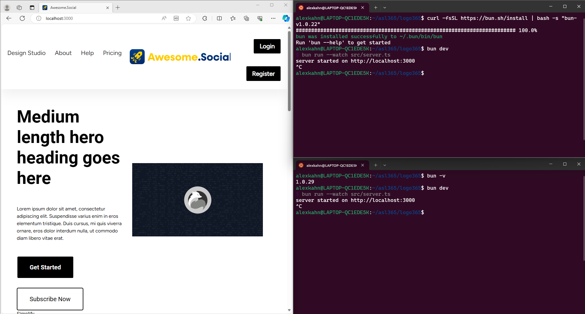
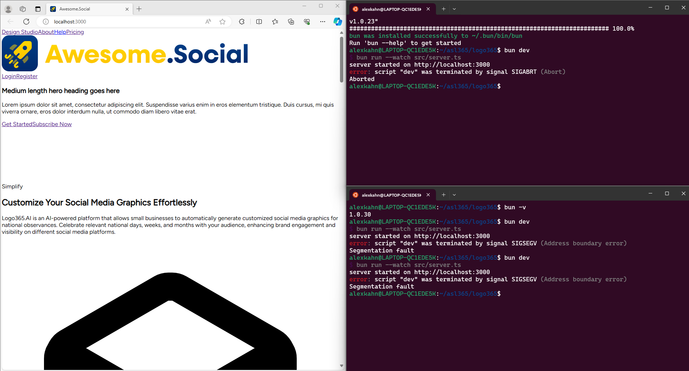

# Test Repository for Bun Issue

This repository is created for testing the issue [9258](https://github.com/oven-sh/bun/issues/9258).

## What version of Bun is running?
1.0.30+1424a196f

## What version did it last work on?
1.0.29+a146856d1

## What platform is your computer?
Linux 5.15.133.1-microsoft-standard-WSL2 x86_64 x86_64

## What steps can reproduce the bug?

To get started with testing the Bun issue, follow these steps:

1. Clone this repository to your local machine.
2. ```bun install```
3. ```bun dev```

## Expected Behavior

The expected behavior is that bun run server.ts should start the server and going to the localhost triggers the "/" route which gets the home page html and then hydrates it with css and javascript once its been loaded.

## What do you see instead?

The server starts on bun run server.ts but when you go to the localhost the server crashes due to a SIGSEGV error. Depending on how long the server was able to serve the request before it crashes different amounts of css are loaded onto the page often times with most of it missing. The localhost website is no longer usable and if you click any of the links it will try to navigate and fail since the server is not running.

## Example

Also included are two screenshots one is the expected behavior and the other is the current behavior. The screenshots also show that this issue was started in v1.0.23 and fixed in v1.0.29 then reintroduced by v1.0.30.

### Working


### Current



## Additional Information

When creating this simplified version of the original project the error isolated itself. The problem is on line 41 of `server.ts` when the neon.tech connections is attempted to be made. Commenting out this line makes the program work as intended, and the variable created is not used in this setup so the connection itself is the issue. 

## Thank You

To anyone taking the time to look at this thank you, you are appreciated!